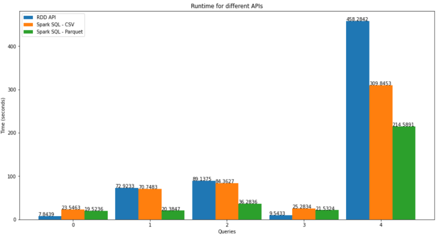

# SparkProject

by Spiros Valouxis and Athanasios Georgoutsos

## Use of Apache Spark in Databases

 We use Apache Spark to perform queries on files from a dataset regarding movies, genres and ratings. 

 This is a subset of a version of Full MovieLens Dataset provided by Kaggle.

 For the queries we usetwo APIs:

 * RDD API
 * Dataframe API / Spark SQL

For the RDD scripts:

In order to calculate running time for our scripts, we wrote the results of the workers to a directory in the hdfs.

In order to print and save results to txt files, we used the ".collect()" method at the end,
printed the results and redirected them from the terminal to an output txt file.

For the SparkSQL scripts:

For calculating the running time, we used the same procedure as above.

For printing and saving the results, we also used the same procedure as above, just without the use of ".collect()",
which is used only for RDD API

